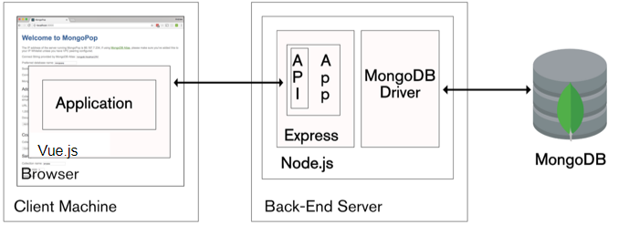

# kiosk-reg

## Nonfunctional requirements
Below is the highlevel architecture of the kiosk registration project with the relevant technologies of the MEVN stack and a visual of their purpose. An explination as to why these technologies were chosen is found below.



The kiosk-reg project is built on the MEVN stack (MongoDB, Express, Vue, and Nodejs). The decision to use MEVN came after considering other potential stacks, the stacks considered were MEAN (MongoDB, Express, Angularjs, and Nodejs), MERN (MongoDB, Express, React, and Nodejs), and LAMP (Linux, Apache, MySQL, and PHP). The MEAN and MERN stacks are similar to the MEVN stack with the only difference being the front end, the advantages of using MEAN or MERN is that they have a lot of community support and great documentation. However, Vue and the MEVN stack was chosen due to previous knowledge and experience using that technology. The LAMP stack was briefly considered because of previous projects built on this stack, however it was not chosen due to its reliance of aging technologies such as PHP. Other technologies used in the kiosk-reg project are mongoose, passport, and bootstrap, these technologies were chosen due to their ease of use, past experince, and good documentation.

## Installation instructions
The following are installation instructions, these instructions assume MongoDB is already installed and running.
Instructions on installing MongoDB can be found at https://docs.mongodb.com/manual/installation/

First step is to create a .env file in the project's root directory with the information shown bellow:
```
PORT=3000
MONGO_URI=mongodb:<your mongo URI> 
APP_URL=http://localhost:3000/

```
Once the .env is created, run the following to install dependencies and run the front and back end.
``` bash
# install dependencies
npm install
# serve at localhost:8080
npm run dev
# run backend server in separate terminal served at localhost:3000
./node_modules/nodemon/bin/nodemon.js server.js
```
## Architecture discussion 
The architecture of the kiok-reg project is as follows, the server side will be running MongoDB which is the database that the signed in users will be stored in. The server will also be running Nodejs with express and mongoose which is used to provide functionality and access to the database from the backend api, in addition passport will be used to validate administrators. The front end is built with HTML and Vue, the styling is provided by CSS and Bootstrap. The basic way the front end works is as follows, when a event is triggered (such as submit, onClick, or input) a function is called that sends a request to the server's api (such as POST or GET) the response is then stored in the Vue store which can be accessed and even watched for changes.   

## Plan of action
- [x] Nonfunctional analysis
- [x] Architecture design
- [x] tooling
- [x] coding
    - [x] Backend User
    - [x] Backend Admin
    - [x] Frontend User
    - [x] Frontend Admin
- [x] testing
- [x] deployment (local)
